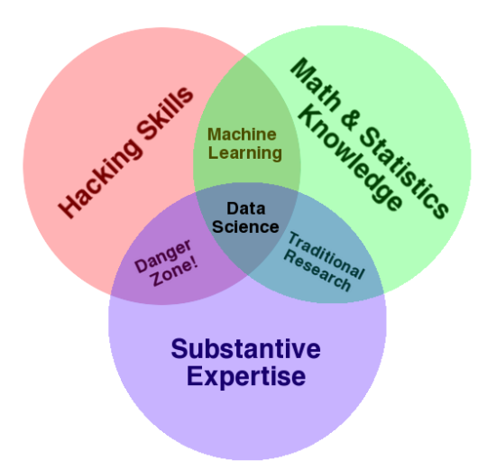

# ai-playground
Getting to know AI &amp; ML &amp; other latest buzzwords

## Background

“Mehr und mehr bestimmen, wie wir alle wissen, die Mikroelektronik, die modernen Rechentechnik, die rechengestützte konstruktion, Projektierung und Steuerung der Produktion das Leistungsvermögen einer modernen Volkswirtschaft.” 
- Erich Honecker, 1986

“These parallels are close and striking enough to make it almost certain that, as in the earlier industrial revolutions, the main effects of the information revolution on the next society still lie ahead."
- Peter Drucker, 2001

## Road ahead

I have so far done one course on AI to get big picture https://course.elementsofai.com/. I have already understood that it might be possible to "hack" the way thru AI and ML without understanding mathematical base of it, but this seems wrong strategy. So, even if order is not fixed, my path will contain business reasoning, mathematical foundations as well as frameworks and tools.

Business insights might be well embodied at Preciction machines https://www.predictionmachines.ai/ and https://www.amazon.com/Prediction-Machines-Economics-Artificial-Intelligence/dp/1633695670/

Mathematical foundations are described at <...>

Tools & Frameworks are described at <...>

## Promise of AI

## Machine Learning as subfield of AI

## Tensorflow

## Spark?

What does Spark here? Are Java & Scala dead languages at AI domain? Or is it possible to combine Tensorflow & Spark? Get data movement and usage to battle tested platform and have Tensorflow as extension to give muscles to Spark.

Here's what Yahoo has thought about it

https://techcrunch.com/2017/02/13/yahoo-supercharges-tensorflow-with-apache-spark/

https://github.com/yahoo/TensorFlowOnSpark

And here's Googles PaaS variant

https://cloud.google.com/blog/big-data/2017/11/using-apache-spark-with-tensorflow-on-google-cloud-platform

https://github.com/GoogleCloudPlatform/cloud-dataproc/tree/master/spark-tensorflow

Books on topic

https://www.manning.com/books/spark-with-java
